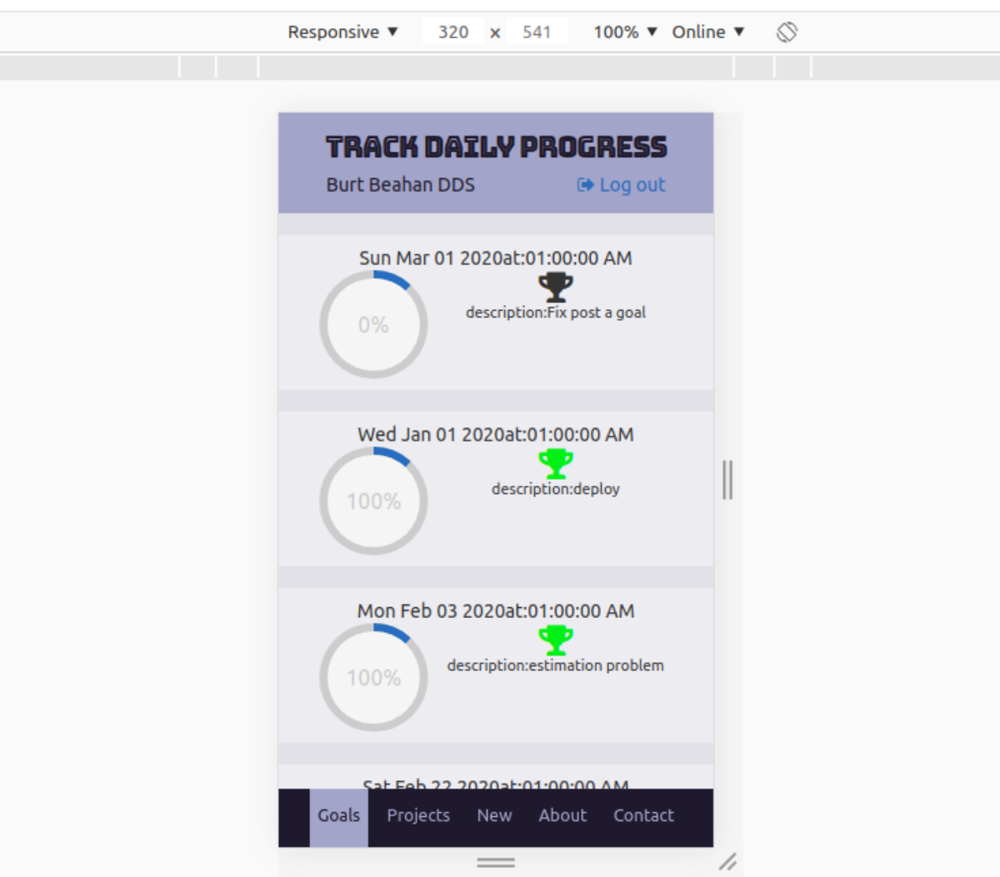

# PROJECT: Track daily steps
Track Daily Steps is a web app that tracks daily projects and tasks for a given user. The project was built to comply with business specifications in order to obtain feedback on technical achievements and soft skills gained.

> This project is part of a series of projects to be completed by students of [Microverse](https://www.microverse.org/ 'The Global School for Remote Software Developers!').

## Live Demo

[Live Demo Link](https://track-daily-steps.herokuapp.com/) .

## Built With
- Ruby On Rails.
- Ruby gems.
- React.
- Redux.
- Npm.
- Yarn.
- Html.
- CSS.
- ES6.

## Test With
- Rspec

## Features:
- An interactive application that respond to user interactions.
- Application that have phone, tablet, and desktop versions.
- A Secured application which have a user authentication.
- User is able to create new projects and its daily steps.
- User have the access to his list of projects and tracks and check the progress of it within time.
- User's progress presented with a persentage circles, that permit to see progress and achievments easily.

To get a local copy up and running follow these simple example steps.

### Prerequisites

1. Git.
2. Code editor.
3. browser.

## How to run the program

1. Open the terminal.

2. Enter `git clone https://github.com/othman-19/track-daily-steps`.

3. Navigate to the cloned repository.

4. In the terminal cd into track-daily-steps.

5. Run `npm install` in your terminal.

6. Install bundle by typing `bundle install` and update it by typing `bundle update` in the terminal.

7. Run `rails db:create` then `rails db:migrate` then `rails db:seed` to get a data base with fake data.

8. Run the rails server by typing `rails server` in the terminal.

9. Open [http://localhost:3000](http://localhost:3000) to view it in the browser.
10. Sign Up and create some projects and daily tracks.

## Author(s)
[6.2]: http://i.imgur.com/9I6NRUm.png (github icon without padding)

[Othmane Namani](https://github.com/othman-19/).  
[Email: othmanenaamani@gmail.com](mailto:othmanenaamani@gmail.com).  
[Portfilio](https://othman-19.github.io/my_portfolio/).  
[LinkedIn](https://www.linkedin.com/in/othman-namani/).  
[twitter](https://twitter.com/ONaamani).  
[DEV Community](https://dev.to/othman).  
[Angel List](https://angel.co/othmane-namani).  

## 🤝 Contributing

Contributions, issues and feature requests are welcome!

Feel free to check the [issues page](issues/).

## Credits
  UI Design by [Gregoire Vella](https://www.behance.net/gregoirevella)
## Show your support

Give a ⭐️ if you like this project!
